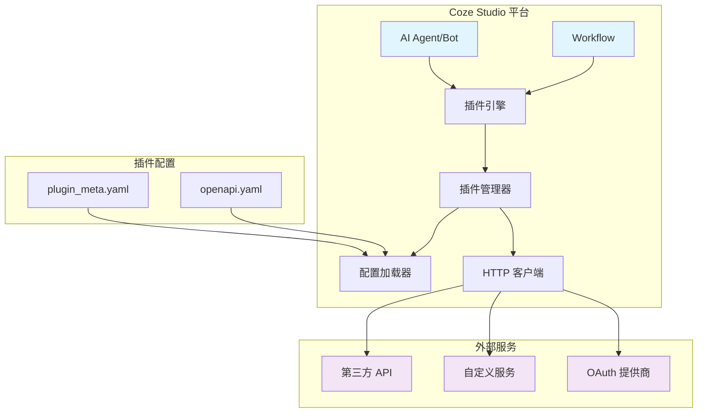
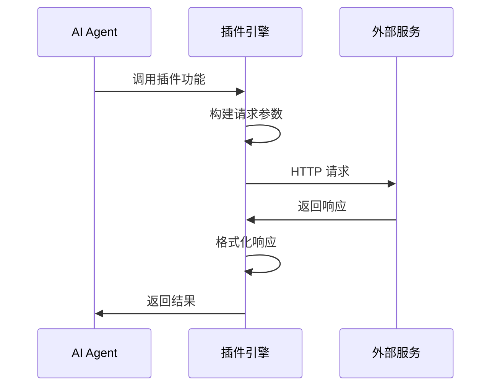
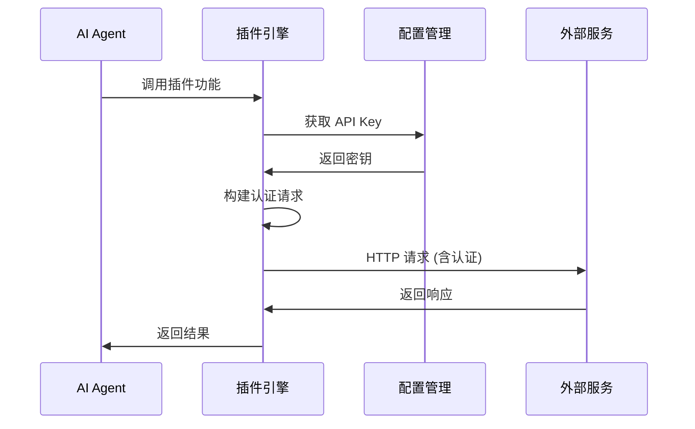
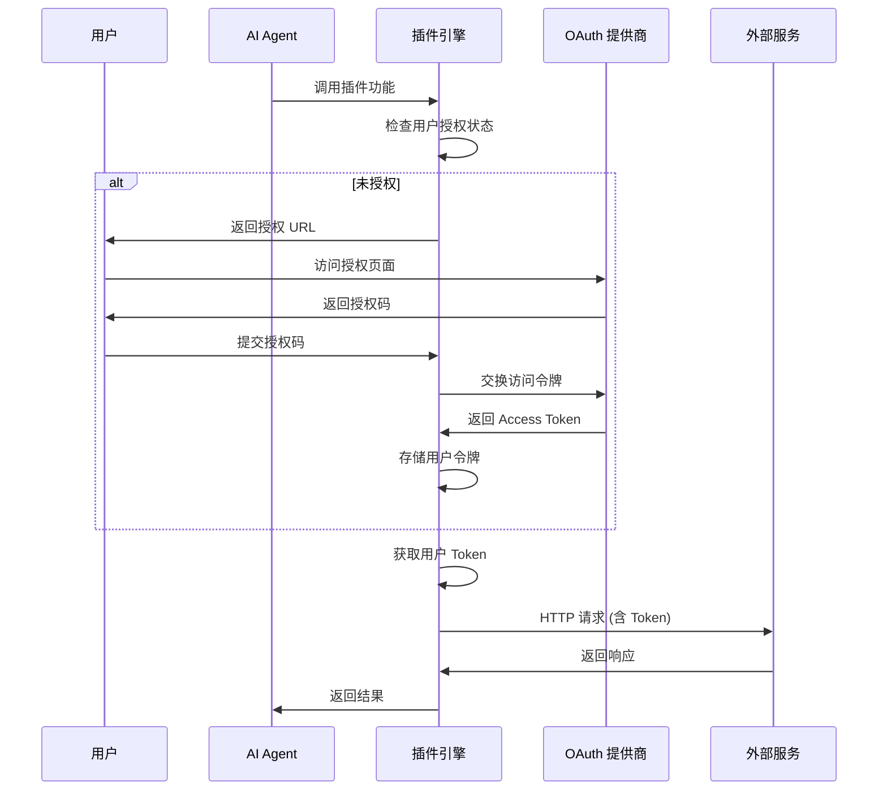
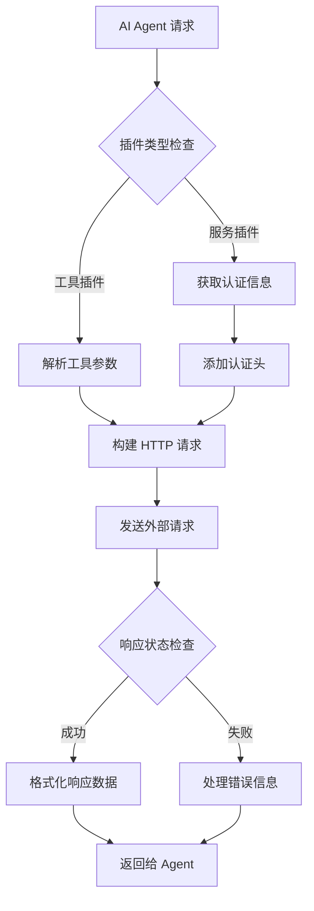
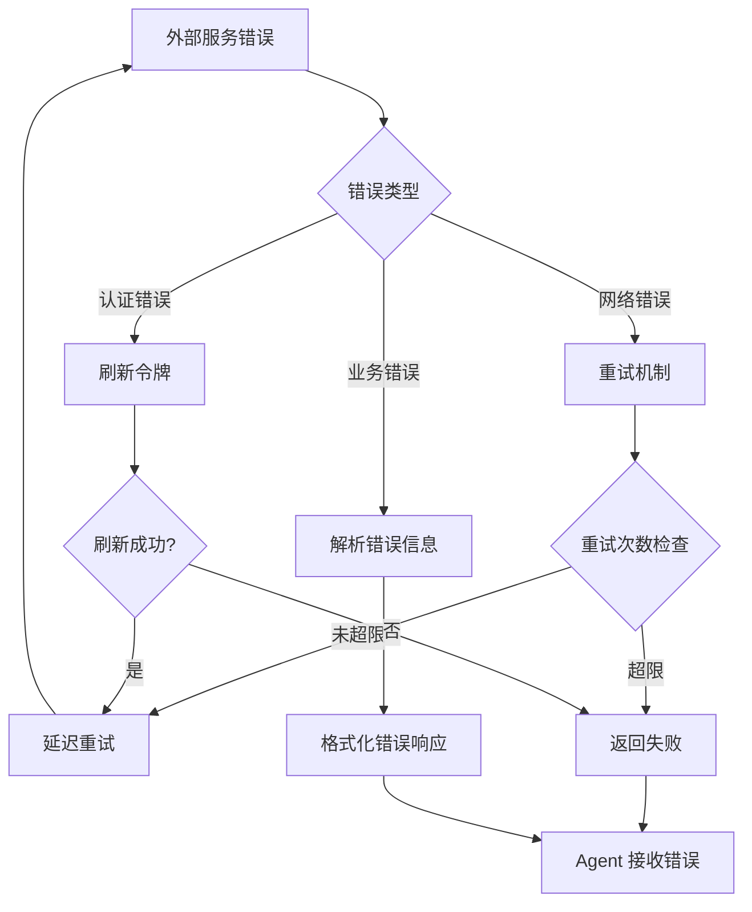
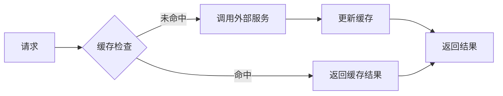

# 插件系统架构说明

本文档详细介绍 Coze Studio 插件系统的架构设计、工作原理和核心组件。

## 系统概览

Coze Studio 采用基于外部服务调用的插件架构，通过 OpenAPI 3.0.1 规范定义插件接口，实现与第三方服务的无缝集成。



## 核心组件

### 1. 插件引擎 (Plugin Engine)

插件引擎是 Coze Studio 插件系统的核心，负责：

- **插件发现**: 扫描并加载插件配置文件
- **接口解析**: 解析 OpenAPI 规范生成调用接口
- **请求路由**: 将 AI Agent 的请求路由到对应的插件服务
- **响应处理**: 处理外部服务响应并格式化返回数据

### 2. 插件管理器 (Plugin Manager)

管理插件的生命周期和状态：

```go
type PluginManager struct {
    plugins map[int64]*PluginInfo  // 插件信息缓存
    tools   map[int64]*ToolInfo    // 工具信息缓存
    oauth   OAuthManager           // OAuth 认证管理
}

type PluginInfo struct {
    ID          int64              // 插件 ID
    ProductID   int64              // 产品 ID
    Version     string             // 版本号
    Manifest    *PluginManifest    // 插件清单
    OpenapiDoc  *openapi3.T        // OpenAPI 文档
    Tools       []*VersionTool     // 工具列表
}
```

### 3. 配置加载器 (Configuration Loader)

从配置文件中加载插件定义：

- **元数据加载**: 从 `plugin_meta.yaml` 加载插件基本信息
- **OpenAPI 解析**: 解析 OpenAPI 文档生成接口定义
- **校验检查**: 验证配置文件的完整性和正确性

### 4. HTTP 客户端 (HTTP Client)

处理与外部服务的通信：

- **请求构建**: 根据 OpenAPI 规范构建 HTTP 请求
- **认证处理**: 处理各种认证方式（无认证、API Key、OAuth）
- **错误处理**: 统一处理网络错误和业务错误
- **重试机制**: 实现请求重试和超时处理

## 插件类型架构

### 无认证插件 (None Auth)



**特点**:
- 无需认证配置
- 直接 HTTP 请求
- 适用于公开 API

### API Key 认证插件 (Service HTTP)



**特点**:
- 服务端存储 API Key
- 支持 Header/Query/Body 位置
- 适用于服务端认证的 API

### OAuth 认证插件 (OAuth 2.0)



**特点**:
- 用户级别认证
- 支持 Authorization Code 流程
- 令牌自动刷新和管理

## 数据流架构

### 请求处理流程



### 错误处理流程



## 存储架构

### 插件配置存储

```
backend/conf/plugin/
├── pluginproduct/
│   ├── plugin_meta.yaml        # 插件元数据总配置
│   ├── document_converter.yaml # 各插件的 OpenAPI 定义
│   ├── image_compression.yaml
│   └── ...
├── common/
│   └── oauth_schema.json       # OAuth 配置模板
└── official_plugin_icon/       # 插件图标资源
```

### 数据库存储

插件系统使用以下数据表：

- **plugin**: 插件基本信息
- **plugin_draft**: 插件草稿版本
- **plugin_version**: 插件已发布版本
- **tool**: 插件工具定义
- **tool_draft**: 工具草稿版本
- **tool_version**: 工具已发布版本
- **plugin_oauth_auth**: OAuth 认证信息

## 安全架构

### 认证安全

1. **API Key 保护**:
   - 服务端加密存储
   - 请求时动态解密
   - 支持密钥轮换

2. **OAuth 令牌管理**:
   - 访问令牌加密存储
   - 自动刷新过期令牌
   - 支持令牌撤销

3. **请求签名**:
   - HMAC-SHA256 签名验证
   - 时间戳防重放攻击
   - nonce 防重复请求

### 网络安全

1. **HTTPS 通信**:
   - 强制 TLS 1.2+ 加密
   - 证书链验证
   - HSTS 策略

2. **请求限制**:
   - 频率限制 (Rate Limiting)
   - 请求大小限制
   - 超时控制

3. **数据验证**:
   - 输入参数验证
   - 响应格式校验
   - XSS/SQL注入防护

## 性能架构

### 缓存策略



**缓存层级**:
- **L1 缓存**: 内存缓存（插件配置、Schema）
- **L2 缓存**: Redis 缓存（API 响应、令牌）
- **L3 缓存**: 数据库缓存（用户授权状态）

### 连接池管理

- **HTTP 连接池**: 复用 TCP 连接减少握手开销
- **数据库连接池**: 控制并发连接数
- **Redis 连接池**: 优化缓存访问性能

### 异步处理

- **非阻塞 I/O**: 使用 Hertz 框架的异步能力
- **并发控制**: Goroutine 池管理并发请求
- **批量处理**: 支持批量 API 调用优化

## 扩展性设计

### 插件热加载

```go
type PluginHotReloader struct {
    watcher   *fsnotify.Watcher
    manager   *PluginManager
    reloadCh  chan string
}

func (r *PluginHotReloader) Watch() {
    for {
        select {
        case event := <-r.watcher.Events:
            if event.Op&fsnotify.Write == fsnotify.Write {
                r.reloadCh <- event.Name
            }
        case err := <-r.watcher.Errors:
            log.Error("file watch error:", err)
        }
    }
}
```

### 多版本支持

- **向后兼容**: 支持多个版本的 API 并存
- **渐进升级**: 平滑的版本迁移机制  
- **版本路由**: 基于版本号的请求路由

### 插件市场

- **插件发布**: 标准化的插件打包和发布流程
- **版本管理**: 语义化版本控制
- **依赖管理**: 插件间依赖关系处理

## 监控和日志

### 指标监控

- **请求指标**: QPS、延迟、错误率
- **业务指标**: 插件使用量、成功率
- **系统指标**: CPU、内存、网络使用率

### 链路追踪

- **请求追踪**: 完整的请求调用链
- **性能分析**: 各环节耗时统计
- **错误定位**: 异常堆栈和上下文

### 日志管理

- **结构化日志**: JSON 格式便于检索
- **日志分级**: DEBUG、INFO、WARN、ERROR
- **日志聚合**: 集中式日志收集和分析

---

通过这种架构设计，Coze Studio 插件系统实现了高度的可扩展性、安全性和性能，为开发者提供了强大而灵活的插件开发平台。