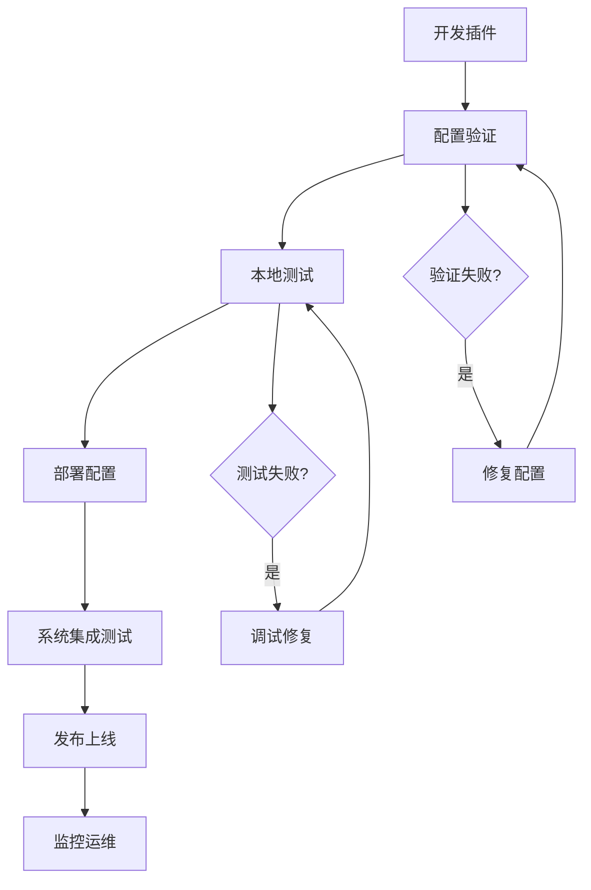

# 插件部署和测试指南

本文档详细介绍 Coze Studio 插件的部署流程、测试方法和故障排查。

## 部署流程概览



## 部署前准备

### 1. 配置文件验证

#### 验证脚本

```bash
#!/bin/bash
# deploy-check.sh

echo "🔍 开始部署前检查..."

# 1. 验证 YAML 语法
echo "📝 验证配置文件语法..."
for file in backend/conf/plugin/pluginproduct/*.yaml; do
    if [[ $file == *"plugin_meta.yaml" ]]; then
        continue
    fi
    
    echo "检查 $file"
    yq eval '.' "$file" > /dev/null
    if [ $? -ne 0 ]; then
        echo "❌ $file 语法错误"
        exit 1
    fi
done

# 2. 验证 OpenAPI 规范
echo "🔧 验证 OpenAPI 规范..."
if command -v swagger &> /dev/null; then
    for file in backend/conf/plugin/pluginproduct/*.yaml; do
        if [[ $file == *"plugin_meta.yaml" ]]; then
            continue
        fi
        
        swagger validate "$file"
        if [ $? -ne 0 ]; then
            echo "❌ $file OpenAPI 规范验证失败"
            exit 1
        fi
    done
fi

# 3. 检查必需文件
echo "📁 检查必需文件..."
required_files=(
    "backend/conf/plugin/pluginproduct/plugin_meta.yaml"
    "backend/conf/plugin/common/oauth_schema.json"
)

for file in "${required_files[@]}"; do
    if [ ! -f "$file" ]; then
        echo "❌ 缺少必需文件: $file"
        exit 1
    fi
done

echo "✅ 所有检查通过，准备就绪！"
```

#### 使用 Python 验证

```python
#!/usr/bin/env python3
# validate-deployment.py

import yaml
import json
import jsonschema
from pathlib import Path
from typing import Dict, List

def validate_yaml_syntax(file_path: Path) -> bool:
    """验证 YAML 文件语法"""
    try:
        with open(file_path, 'r', encoding='utf-8') as f:
            yaml.safe_load(f)
        return True
    except yaml.YAMLError as e:
        print(f"❌ YAML 语法错误 {file_path}: {e}")
        return False

def validate_plugin_meta(meta_file: Path) -> bool:
    """验证插件元数据文件"""
    try:
        with open(meta_file, 'r', encoding='utf-8') as f:
            plugins = yaml.safe_load(f)
        
        if not isinstance(plugins, list):
            print("❌ plugin_meta.yaml 应该是数组格式")
            return False
        
        required_fields = [
            'plugin_id', 'product_id', 'version', 
            'openapi_doc_file', 'manifest', 'tools'
        ]
        
        for plugin in plugins:
            for field in required_fields:
                if field not in plugin:
                    print(f"❌ 插件 {plugin.get('plugin_id')} 缺少字段: {field}")
                    return False
        
        return True
    except Exception as e:
        print(f"❌ 验证插件元数据失败: {e}")
        return False

def validate_openapi_spec(spec_file: Path) -> bool:
    """验证 OpenAPI 规范"""
    try:
        with open(spec_file, 'r', encoding='utf-8') as f:
            spec = yaml.safe_load(f)
        
        # 基础字段检查
        required_fields = ['openapi', 'info', 'paths']
        for field in required_fields:
            if field not in spec:
                print(f"❌ {spec_file} 缺少字段: {field}")
                return False
        
        # 版本检查
        if not spec['openapi'].startswith('3.0'):
            print(f"❌ {spec_file} OpenAPI 版本应该是 3.0.x")
            return False
        
        return True
    except Exception as e:
        print(f"❌ 验证 OpenAPI 规范失败 {spec_file}: {e}")
        return False

def main():
    """主验证流程"""
    print("🔍 开始插件部署验证...")
    
    plugin_dir = Path("backend/conf/plugin/pluginproduct")
    
    # 验证插件元数据
    meta_file = plugin_dir / "plugin_meta.yaml"
    if not validate_plugin_meta(meta_file):
        exit(1)
    
    # 验证所有 OpenAPI 文件
    for yaml_file in plugin_dir.glob("*.yaml"):
        if yaml_file.name == "plugin_meta.yaml":
            continue
        
        if not validate_yaml_syntax(yaml_file):
            exit(1)
        
        if not validate_openapi_spec(yaml_file):
            exit(1)
    
    print("✅ 所有验证通过！")

if __name__ == "__main__":
    main()
```

### 2. 外部服务准备

#### 服务可用性检查

```bash
#!/bin/bash
# check-external-services.sh

# 从配置文件中提取服务器 URL
extract_server_urls() {
    for file in backend/conf/plugin/pluginproduct/*.yaml; do
        if [[ $file == *"plugin_meta.yaml" ]]; then
            continue
        fi
        
        echo "检查 $file 中的服务器..."
        yq eval '.servers[].url' "$file" 2>/dev/null | while read -r url; do
            if [[ $url != "null" && $url != "" ]]; then
                echo "测试服务器: $url"
                
                # 基础连通性测试
                if curl -s --connect-timeout 10 --head "$url" > /dev/null; then
                    echo "✅ $url 可访问"
                else
                    echo "❌ $url 不可访问"
                fi
                
                # 健康检查（如果有健康检查端点）
                health_url="$url/health"
                if curl -s --connect-timeout 5 "$health_url" > /dev/null 2>&1; then
                    echo "✅ $health_url 健康检查通过"
                fi
            fi
        done
    done
}

echo "🔍 检查外部服务可用性..."
extract_server_urls
echo "✅ 外部服务检查完成"
```

#### API 端点测试

```python
#!/usr/bin/env python3
# test-api-endpoints.py

import yaml
import requests
import json
from pathlib import Path
from typing import Dict, Any

def test_api_endpoint(base_url: str, path: str, method: str, spec: Dict[str, Any]) -> bool:
    """测试 API 端点"""
    url = f"{base_url.rstrip('/')}{path}"
    
    try:
        if method.lower() == 'get':
            response = requests.get(url, timeout=10)
        elif method.lower() == 'post':
            # 使用示例数据或空数据测试
            test_data = {}
            if 'requestBody' in spec:
                # 尝试构造测试数据
                pass
            response = requests.post(url, json=test_data, timeout=10)
        else:
            print(f"⚠️  暂不支持测试 {method} 方法")
            return True
        
        print(f"📡 {method.upper()} {url} -> {response.status_code}")
        return response.status_code < 500  # 5xx 错误认为是失败
        
    except requests.exceptions.RequestException as e:
        print(f"❌ 请求失败 {method.upper()} {url}: {e}")
        return False

def test_openapi_spec(spec_file: Path) -> bool:
    """测试 OpenAPI 规范中的端点"""
    with open(spec_file, 'r', encoding='utf-8') as f:
        spec = yaml.safe_load(f)
    
    servers = spec.get('servers', [])
    paths = spec.get('paths', {})
    
    if not servers:
        print(f"⚠️  {spec_file} 没有定义服务器")
        return True
    
    success_count = 0
    total_count = 0
    
    for server in servers:
        base_url = server['url']
        print(f"🌐 测试服务器: {base_url}")
        
        for path, methods in paths.items():
            for method, endpoint_spec in methods.items():
                if method in ['get', 'post', 'put', 'delete', 'patch']:
                    total_count += 1
                    if test_api_endpoint(base_url, path, method, endpoint_spec):
                        success_count += 1
    
    success_rate = success_count / total_count if total_count > 0 else 1
    print(f"📊 {spec_file.name}: {success_count}/{total_count} 端点可访问 ({success_rate:.1%})")
    
    return success_rate > 0.5  # 至少50%端点可用

def main():
    """主测试流程"""
    print("🧪 开始 API 端点测试...")
    
    plugin_dir = Path("backend/conf/plugin/pluginproduct")
    
    for yaml_file in plugin_dir.glob("*.yaml"):
        if yaml_file.name == "plugin_meta.yaml":
            continue
        
        print(f"\n测试 {yaml_file.name}...")
        test_openapi_spec(yaml_file)

if __name__ == "__main__":
    main()
```

## 本地测试

### 1. 启动开发环境

```bash
# 启动完整开发环境
make debug

# 或分步启动
make middleware  # 启动中间件服务
make server     # 启动后端服务
cd frontend/apps/coze-studio && npm run dev  # 启动前端
```

### 2. 插件配置热加载

```bash
# 重载插件配置（需要实现热重载功能）
curl -X POST http://localhost:8080/admin/reload-plugins

# 查看当前加载的插件
curl http://localhost:8080/admin/plugins | jq .
```

### 3. 插件功能测试

#### 创建测试脚本

```bash
#!/bin/bash
# test-plugin-locally.sh

COZE_API_BASE="http://localhost:8080"
PLUGIN_NAME="document_converter"

echo "🧪 测试插件: $PLUGIN_NAME"

# 1. 检查插件是否已加载
echo "📋 检查插件状态..."
plugin_status=$(curl -s "$COZE_API_BASE/admin/plugins" | jq -r ".plugins[] | select(.name==\"$PLUGIN_NAME\") | .status")

if [ "$plugin_status" != "active" ]; then
    echo "❌ 插件未激活，状态: $plugin_status"
    exit 1
fi

# 2. 测试插件功能
echo "🔧 测试插件功能..."
test_data='{
    "fileUrl": "https://www.w3.org/WAI/ER/tests/xhtml/testfiles/resources/pdf/dummy.pdf",
    "outputFormat": "markdown",
    "preserveFormatting": true
}'

response=$(curl -s -X POST \
    -H "Content-Type: application/json" \
    -d "$test_data" \
    "$COZE_API_BASE/api/plugin/invoke/$PLUGIN_NAME/convert_document")

echo "📤 响应数据:"
echo "$response" | jq .

# 3. 验证响应
success=$(echo "$response" | jq -r '.success // false')
if [ "$success" = "true" ]; then
    echo "✅ 插件测试通过"
else
    echo "❌ 插件测试失败"
    echo "$response" | jq -r '.error // "未知错误"'
    exit 1
fi
```

#### 使用 Postman/Insomnia 测试

创建测试集合：

```json
{
  "info": {
    "name": "文档转换器插件测试",
    "description": "Coze Studio 文档转换器插件 API 测试"
  },
  "item": [
    {
      "name": "转换 PDF 文档",
      "request": {
        "method": "POST",
        "header": [
          {
            "key": "Content-Type",
            "value": "application/json"
          }
        ],
        "body": {
          "mode": "raw",
          "raw": "{\n  \"fileUrl\": \"https://example.com/sample.pdf\",\n  \"outputFormat\": \"markdown\",\n  \"preserveFormatting\": true\n}"
        },
        "url": {
          "raw": "{{base_url}}/api/convert",
          "host": ["{{base_url}}"],
          "path": ["api", "convert"]
        }
      },
      "response": []
    }
  ],
  "variable": [
    {
      "key": "base_url",
      "value": "http://localhost:8080"
    }
  ]
}
```

### 4. 集成测试

#### Agent 集成测试

```python
#!/usr/bin/env python3
# test-agent-integration.py

import requests
import json
import time

class CozeAgentTester:
    def __init__(self, base_url: str):
        self.base_url = base_url.rstrip('/')
        self.session = requests.Session()
    
    def create_test_agent(self) -> str:
        """创建测试 Agent"""
        agent_config = {
            "name": "文档处理测试 Agent",
            "description": "用于测试文档转换插件的 Agent",
            "plugins": ["document_converter"],
            "instructions": "你是一个文档处理助手，可以帮助用户转换文档格式。"
        }
        
        response = self.session.post(
            f"{self.base_url}/api/agents",
            json=agent_config
        )
        response.raise_for_status()
        return response.json()['agent_id']
    
    def chat_with_agent(self, agent_id: str, message: str) -> dict:
        """与 Agent 对话"""
        chat_data = {
            "message": message,
            "agent_id": agent_id
        }
        
        response = self.session.post(
            f"{self.base_url}/api/chat",
            json=chat_data
        )
        response.raise_for_status()
        return response.json()
    
    def test_document_conversion(self, agent_id: str) -> bool:
        """测试文档转换功能"""
        test_message = """
        请帮我转换这个文档：
        https://www.w3.org/WAI/ER/tests/xhtml/testfiles/resources/pdf/dummy.pdf
        
        转换为 Markdown 格式。
        """
        
        print("💬 发送测试消息...")
        response = self.chat_with_agent(agent_id, test_message)
        
        print("🤖 Agent 响应:")
        print(response.get('message', ''))
        
        # 检查响应中是否包含转换后的内容
        message = response.get('message', '').lower()
        return 'markdown' in message or '转换' in message
    
    def run_integration_test(self):
        """运行集成测试"""
        print("🚀 开始 Agent 集成测试...")
        
        try:
            # 1. 创建测试 Agent
            print("👤 创建测试 Agent...")
            agent_id = self.create_test_agent()
            print(f"✅ Agent 创建成功: {agent_id}")
            
            # 2. 测试文档转换
            print("📄 测试文档转换...")
            if self.test_document_conversion(agent_id):
                print("✅ 集成测试通过")
                return True
            else:
                print("❌ 集成测试失败")
                return False
                
        except Exception as e:
            print(f"❌ 集成测试异常: {e}")
            return False

if __name__ == "__main__":
    tester = CozeAgentTester("http://localhost:8080")
    success = tester.run_integration_test()
    exit(0 if success else 1)
```

## 生产部署

### 1. 容器化部署

#### Dockerfile

```dockerfile
# 多阶段构建
FROM golang:1.21-alpine AS backend-builder

WORKDIR /app
COPY backend/ .

# 构建后端
RUN go mod download
RUN CGO_ENABLED=0 GOOS=linux go build -o server ./cmd/server

FROM node:18-alpine AS frontend-builder

WORKDIR /app
COPY frontend/ .

# 安装 Rush 并构建前端
RUN npm install -g @microsoft/rush
RUN rush update --bypass-policy
RUN rush build

# 最终镜像
FROM alpine:latest

# 安装运行时依赖
RUN apk --no-cache add ca-certificates tzdata

WORKDIR /app

# 复制后端二进制
COPY --from=backend-builder /app/server .

# 复制前端构建产物
COPY --from=frontend-builder /app/apps/coze-studio/dist ./static

# 复制配置文件
COPY backend/conf ./conf

# 暴露端口
EXPOSE 8080

# 健康检查
HEALTHCHECK --interval=30s --timeout=3s --start-period=5s --retries=3 \
    CMD wget --no-verbose --tries=1 --spider http://localhost:8080/health || exit 1

# 启动服务
CMD ["./server"]
```

#### docker-compose.yml

```yaml
version: '3.8'

services:
  coze-studio:
    build:
      context: .
      dockerfile: Dockerfile
    ports:
      - "8080:8080"
    environment:
      - DB_HOST=mysql
      - REDIS_HOST=redis
      - ES_HOST=elasticsearch
    depends_on:
      - mysql
      - redis
      - elasticsearch
    volumes:
      - ./backend/conf/plugin:/app/conf/plugin:ro
    healthcheck:
      test: ["CMD", "wget", "--quiet", "--tries=1", "--spider", "http://localhost:8080/health"]
      interval: 30s
      timeout: 10s
      retries: 3
    restart: unless-stopped

  mysql:
    image: mysql:8.4.5
    environment:
      - MYSQL_ROOT_PASSWORD=password
      - MYSQL_DATABASE=coze_studio
    volumes:
      - mysql_data:/var/lib/mysql
    ports:
      - "3306:3306"
    restart: unless-stopped

  redis:
    image: redis:8.0-alpine
    ports:
      - "6379:6379"
    volumes:
      - redis_data:/data
    restart: unless-stopped

  elasticsearch:
    image: elasticsearch:8.18.0
    environment:
      - discovery.type=single-node
      - "ES_JAVA_OPTS=-Xms512m -Xmx512m"
    volumes:
      - es_data:/usr/share/elasticsearch/data
    ports:
      - "9200:9200"
    restart: unless-stopped

volumes:
  mysql_data:
  redis_data:
  es_data:
```

### 2. Kubernetes 部署

#### 部署配置

```yaml
# k8s/namespace.yaml
apiVersion: v1
kind: Namespace
metadata:
  name: coze-studio

---
# k8s/configmap.yaml
apiVersion: v1
kind: ConfigMap
metadata:
  name: coze-studio-config
  namespace: coze-studio
data:
  app.yaml: |
    database:
      host: mysql-service
      port: 3306
      name: coze_studio
    redis:
      host: redis-service
      port: 6379

---
# k8s/deployment.yaml
apiVersion: apps/v1
kind: Deployment
metadata:
  name: coze-studio
  namespace: coze-studio
spec:
  replicas: 3
  selector:
    matchLabels:
      app: coze-studio
  template:
    metadata:
      labels:
        app: coze-studio
    spec:
      containers:
      - name: coze-studio
        image: coze-studio:latest
        ports:
        - containerPort: 8080
        env:
        - name: CONFIG_PATH
          value: "/etc/config"
        volumeMounts:
        - name: config
          mountPath: /etc/config
        - name: plugin-config
          mountPath: /app/conf/plugin
        livenessProbe:
          httpGet:
            path: /health
            port: 8080
          initialDelaySeconds: 30
          periodSeconds: 10
        readinessProbe:
          httpGet:
            path: /ready
            port: 8080
          initialDelaySeconds: 5
          periodSeconds: 5
        resources:
          requests:
            memory: "512Mi"
            cpu: "250m"
          limits:
            memory: "1Gi"
            cpu: "500m"
      volumes:
      - name: config
        configMap:
          name: coze-studio-config
      - name: plugin-config
        configMap:
          name: plugin-config

---
# k8s/service.yaml
apiVersion: v1
kind: Service
metadata:
  name: coze-studio-service
  namespace: coze-studio
spec:
  selector:
    app: coze-studio
  ports:
  - port: 80
    targetPort: 8080
  type: LoadBalancer

---
# k8s/ingress.yaml
apiVersion: networking.k8s.io/v1
kind: Ingress
metadata:
  name: coze-studio-ingress
  namespace: coze-studio
  annotations:
    kubernetes.io/ingress.class: "nginx"
    cert-manager.io/cluster-issuer: "letsencrypt"
spec:
  tls:
  - hosts:
    - coze.example.com
    secretName: coze-studio-tls
  rules:
  - host: coze.example.com
    http:
      paths:
      - path: /
        pathType: Prefix
        backend:
          service:
            name: coze-studio-service
            port:
              number: 80
```

#### 部署脚本

```bash
#!/bin/bash
# deploy-k8s.sh

echo "🚀 开始 Kubernetes 部署..."

# 1. 构建 Docker 镜像
echo "🔨 构建 Docker 镜像..."
docker build -t coze-studio:latest .

# 2. 创建插件配置 ConfigMap
echo "📁 创建插件配置..."
kubectl create configmap plugin-config \
  --from-file=backend/conf/plugin/ \
  --namespace=coze-studio \
  --dry-run=client -o yaml | kubectl apply -f -

# 3. 应用 Kubernetes 配置
echo "☸️  应用 Kubernetes 配置..."
kubectl apply -f k8s/

# 4. 等待部署完成
echo "⏳ 等待部署完成..."
kubectl rollout status deployment/coze-studio -n coze-studio

# 5. 验证部署
echo "✅ 验证部署状态..."
kubectl get pods -n coze-studio
kubectl get services -n coze-studio

echo "🎉 部署完成！"
```

### 3. 配置管理

#### 环境配置分离

```yaml
# config/production.yaml
database:
  host: ${DB_HOST}
  port: ${DB_PORT}
  user: ${DB_USER}
  password: ${DB_PASSWORD}
  name: ${DB_NAME}

redis:
  host: ${REDIS_HOST}
  port: ${REDIS_PORT}
  password: ${REDIS_PASSWORD}

plugins:
  config_path: ${PLUGIN_CONFIG_PATH}
  hot_reload: false
  cache_enabled: true

logging:
  level: info
  format: json
  output: stdout
```

#### 密钥管理

```bash
# 使用 Kubernetes Secrets 管理敏感信息
kubectl create secret generic coze-studio-secrets \
  --from-literal=db-password='your-db-password' \
  --from-literal=redis-password='your-redis-password' \
  --from-literal=jwt-secret='your-jwt-secret' \
  --namespace=coze-studio
```

## 监控和日志

### 1. 健康检查

#### 应用健康检查端点

```go
// backend/api/handler/health.go
package handler

import (
    "context"
    "net/http"
    
    "github.com/cloudwego/hertz/pkg/app"
    "github.com/cloudwego/hertz/pkg/protocol/consts"
)

// HealthCheck 健康检查
func HealthCheck(ctx context.Context, c *app.RequestContext) {
    // 检查数据库连接
    if err := checkDatabase(); err != nil {
        c.JSON(consts.StatusServiceUnavailable, map[string]interface{}{
            "status": "unhealthy",
            "error": err.Error(),
        })
        return
    }
    
    // 检查 Redis 连接
    if err := checkRedis(); err != nil {
        c.JSON(consts.StatusServiceUnavailable, map[string]interface{}{
            "status": "unhealthy", 
            "error": err.Error(),
        })
        return
    }
    
    c.JSON(consts.StatusOK, map[string]interface{}{
        "status": "healthy",
        "timestamp": time.Now().UTC(),
        "version": version.Version,
    })
}

// ReadinessCheck 就绪检查
func ReadinessCheck(ctx context.Context, c *app.RequestContext) {
    // 检查插件系统是否就绪
    if !pluginManager.IsReady() {
        c.JSON(consts.StatusServiceUnavailable, map[string]interface{}{
            "status": "not ready",
            "reason": "plugin system not ready",
        })
        return
    }
    
    c.JSON(consts.StatusOK, map[string]interface{}{
        "status": "ready",
    })
}
```

### 2. 指标监控

#### Prometheus 指标

```go
// backend/pkg/metrics/plugin.go
package metrics

import (
    "github.com/prometheus/client_golang/prometheus"
    "github.com/prometheus/client_golang/prometheus/promauto"
)

var (
    PluginRequestTotal = promauto.NewCounterVec(
        prometheus.CounterOpts{
            Name: "coze_plugin_requests_total",
            Help: "Total number of plugin requests",
        },
        []string{"plugin_name", "operation", "status"},
    )
    
    PluginRequestDuration = promauto.NewHistogramVec(
        prometheus.HistogramOpts{
            Name: "coze_plugin_request_duration_seconds", 
            Help: "Plugin request duration in seconds",
            Buckets: []float64{0.1, 0.5, 1, 2, 5, 10},
        },
        []string{"plugin_name", "operation"},
    )
    
    ActivePlugins = promauto.NewGaugeVec(
        prometheus.GaugeOpts{
            Name: "coze_active_plugins",
            Help: "Number of active plugins",
        },
        []string{"plugin_type"},
    )
)

// RecordPluginRequest 记录插件请求指标
func RecordPluginRequest(pluginName, operation, status string, duration float64) {
    PluginRequestTotal.WithLabelValues(pluginName, operation, status).Inc()
    PluginRequestDuration.WithLabelValues(pluginName, operation).Observe(duration)
}
```

#### Grafana 仪表板配置

```json
{
  "dashboard": {
    "id": null,
    "title": "Coze Studio 插件监控",
    "tags": ["coze", "plugins"],
    "panels": [
      {
        "title": "插件请求 QPS",
        "type": "graph",
        "targets": [
          {
            "expr": "rate(coze_plugin_requests_total[5m])",
            "legendFormat": "{{plugin_name}} - {{operation}}"
          }
        ]
      },
      {
        "title": "插件请求延迟",
        "type": "graph", 
        "targets": [
          {
            "expr": "histogram_quantile(0.95, rate(coze_plugin_request_duration_seconds_bucket[5m]))",
            "legendFormat": "P95 - {{plugin_name}}"
          }
        ]
      },
      {
        "title": "插件错误率",
        "type": "stat",
        "targets": [
          {
            "expr": "rate(coze_plugin_requests_total{status=\"error\"}[5m]) / rate(coze_plugin_requests_total[5m])",
            "legendFormat": "错误率"
          }
        ]
      }
    ]
  }
}
```

### 3. 日志管理

#### 结构化日志配置

```go
// backend/pkg/logs/plugin.go
package logs

import (
    "github.com/sirupsen/logrus"
)

// PluginLogger 插件专用日志器
type PluginLogger struct {
    logger *logrus.Entry
}

// NewPluginLogger 创建插件日志器
func NewPluginLogger(pluginName string) *PluginLogger {
    return &PluginLogger{
        logger: logrus.WithFields(logrus.Fields{
            "component": "plugin",
            "plugin_name": pluginName,
        }),
    }
}

// LogRequest 记录请求日志
func (l *PluginLogger) LogRequest(operationId, method, url string, duration float64, statusCode int, err error) {
    fields := logrus.Fields{
        "operation_id": operationId,
        "method": method,
        "url": url,
        "duration_ms": duration * 1000,
        "status_code": statusCode,
    }
    
    if err != nil {
        fields["error"] = err.Error()
        l.logger.WithFields(fields).Error("Plugin request failed")
    } else {
        l.logger.WithFields(fields).Info("Plugin request completed")
    }
}
```

## 故障排查

### 1. 常见问题诊断

#### 插件加载失败

```bash
# 检查配置文件语法
yq eval backend/conf/plugin/pluginproduct/plugin_meta.yaml

# 检查文件权限
ls -la backend/conf/plugin/pluginproduct/

# 查看服务日志
kubectl logs -f deployment/coze-studio -n coze-studio

# 检查配置热重载
curl -X POST http://localhost:8080/admin/reload-plugins
```

#### 外部服务调用失败

```bash
# 测试网络连通性
ping api.example.com
telnet api.example.com 443

# 测试 DNS 解析
nslookup api.example.com

# 检查防火墙规则
iptables -L

# 测试 SSL 证书
openssl s_client -connect api.example.com:443
```

#### 性能问题诊断

```bash
# 查看系统资源使用
top
free -h
df -h

# 查看网络连接
netstat -tulpn
ss -tulpn

# 分析请求日志
grep "plugin_request" /var/log/coze-studio.log | tail -100

# 查看数据库连接
SHOW PROCESSLIST;
```

### 2. 调试工具

#### 日志分析脚本

```python
#!/usr/bin/env python3
# analyze-plugin-logs.py

import json
import sys
from collections import defaultdict
from datetime import datetime

def analyze_plugin_logs(log_file):
    """分析插件日志"""
    stats = defaultdict(int)
    errors = []
    slow_requests = []
    
    with open(log_file, 'r') as f:
        for line in f:
            try:
                log = json.loads(line.strip())
                
                if log.get('component') == 'plugin':
                    plugin_name = log.get('plugin_name', 'unknown')
                    
                    # 统计请求
                    if 'status_code' in log:
                        stats[f"{plugin_name}_requests"] += 1
                        
                        # 错误统计
                        if log.get('status_code', 200) >= 400:
                            stats[f"{plugin_name}_errors"] += 1
                            errors.append(log)
                        
                        # 慢请求统计
                        duration = log.get('duration_ms', 0)
                        if duration > 5000:  # 超过5秒
                            slow_requests.append(log)
                            
            except json.JSONDecodeError:
                continue
    
    # 输出分析结果
    print("📊 插件请求统计:")
    for key, count in stats.items():
        print(f"  {key}: {count}")
    
    print(f"\n❌ 错误请求数: {len(errors)}")
    if errors:
        print("最近错误:")
        for error in errors[-5:]:
            print(f"  {error.get('timestamp')} - {error.get('plugin_name')} - {error.get('error')}")
    
    print(f"\n🐌 慢请求数: {len(slow_requests)}")
    if slow_requests:
        print("最慢请求:")
        for req in sorted(slow_requests, key=lambda x: x.get('duration_ms', 0), reverse=True)[:5]:
            print(f"  {req.get('plugin_name')} - {req.get('operation_id')} - {req.get('duration_ms')}ms")

if __name__ == "__main__":
    if len(sys.argv) != 2:
        print("用法: python analyze-plugin-logs.py <log_file>")
        sys.exit(1)
    
    analyze_plugin_logs(sys.argv[1])
```

## 回滚方案

### 1. 配置回滚

```bash
#!/bin/bash
# rollback-plugin-config.sh

BACKUP_DIR="/backup/plugin-config"
CURRENT_DIR="/app/conf/plugin"

# 创建当前配置备份
backup_current() {
    timestamp=$(date +%Y%m%d_%H%M%S)
    backup_path="$BACKUP_DIR/backup_$timestamp"
    
    echo "💾 备份当前配置到 $backup_path"
    cp -r "$CURRENT_DIR" "$backup_path"
}

# 回滚到指定版本
rollback_to_version() {
    local version=$1
    
    if [ -z "$version" ]; then
        echo "❌ 请指定回滚版本"
        echo "可用版本:"
        ls -1 "$BACKUP_DIR" | grep backup_
        exit 1
    fi
    
    backup_path="$BACKUP_DIR/$version"
    
    if [ ! -d "$backup_path" ]; then
        echo "❌ 版本不存在: $version"
        exit 1
    fi
    
    echo "🔄 回滚到版本: $version"
    backup_current
    rm -rf "$CURRENT_DIR"
    cp -r "$backup_path" "$CURRENT_DIR"
    
    # 重载插件配置
    curl -X POST http://localhost:8080/admin/reload-plugins
    
    echo "✅ 回滚完成"
}

# 主逻辑
case "$1" in
    "backup")
        backup_current
        ;;
    "rollback")
        rollback_to_version "$2"
        ;;
    *)
        echo "用法: $0 {backup|rollback <version>}"
        echo "示例: $0 rollback backup_20231201_143022"
        ;;
esac
```

### 2. 服务回滚

```bash
#!/bin/bash
# rollback-service.sh

NAMESPACE="coze-studio"
DEPLOYMENT="coze-studio"

# 查看回滚历史
view_rollout_history() {
    echo "📜 查看部署历史:"
    kubectl rollout history deployment/$DEPLOYMENT -n $NAMESPACE
}

# 回滚到上一版本
rollback_to_previous() {
    echo "🔄 回滚到上一版本..."
    kubectl rollout undo deployment/$DEPLOYMENT -n $NAMESPACE
    
    # 等待回滚完成
    kubectl rollout status deployment/$DEPLOYMENT -n $NAMESPACE
    
    echo "✅ 回滚完成"
}

# 回滚到指定版本
rollback_to_revision() {
    local revision=$1
    
    if [ -z "$revision" ]; then
        echo "❌ 请指定回滚版本"
        view_rollout_history
        exit 1
    fi
    
    echo "🔄 回滚到版本: $revision"
    kubectl rollout undo deployment/$DEPLOYMENT --to-revision=$revision -n $NAMESPACE
    
    # 等待回滚完成
    kubectl rollout status deployment/$DEPLOYMENT -n $NAMESPACE
    
    echo "✅ 回滚完成"
}

# 主逻辑
case "$1" in
    "history")
        view_rollout_history
        ;;
    "previous")
        rollback_to_previous
        ;;
    "revision")
        rollback_to_revision "$2"
        ;;
    *)
        echo "用法: $0 {history|previous|revision <number>}"
        echo "示例: $0 revision 3"
        ;;
esac
```

## 下一步

部署完成后，您可以：

1. 💡 查看 [最佳实践指南](./best-practices.md) 了解优化建议
2. 📚 浏览 [示例插件](./examples/) 学习更多开发技巧
3. 🔍 参与社区讨论，分享您的部署经验

---

成功的部署需要充分的测试和监控。遵循本指南的流程，可以确保您的插件稳定可靠地为用户提供服务。